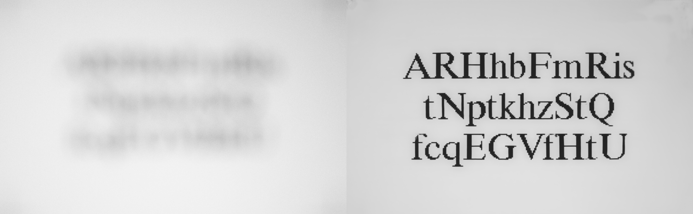
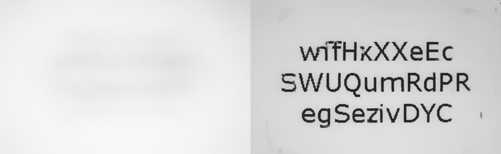

# Code for Helsinki Deblur Challenge 2021
## Authors, institution, location
Below is the information for the authors.
 + *Author*       Ji Li
 + *Institution*  Department of Mathematics, National University of Singapore
 + *Location*    21 Lower Kent Ridge Rd, Singapore 119077  
 -------
## Brief description of your algorithm and a mention of the competition
 Our deblurring algorithm is a deep learning approach, as there have been provided the training datasets. Our deblurring network backbone is borrowed from the DeblurGanV2. Note that we have not used the GAN training loss. 
 
 For this task, the blurring level is very high. And we find in the training stage, it is hard to decrease the training loss. To address such issue, we proposed the following modifications:
 + To increase the receptive field of deblurring, we propose two-stage approach to deblur the text image: We first downscale the blurred input, and train the *deblur network* using the downscaled truth image. After the deblur network does well for deblurring the downscaled input. We then train a *super resolution network* to enlarge the image size. At last, we finetune the two networks using the datasets.
 + Since we have additional information of the blur level, we modified the deblur network and super resolution network using the conditional information. Such conditional information is incorporated into the network by conditional instance-norm layer.

 This code repository is uploaded for competition of Helsinki Deblur Challenge 2021.

 ## Installation instructions, including any requirements
See the ```requirement.txt``` to install the dependent packages and libraries.

 + Clone the github repository
   
   ```python
   git clone https://github.com/Chilie/HDC2021_code.git
   cd HDC2021_code
   ```
 + Use ```virtualenv```  to construct the virtual environment
    ```python
    pip3 install virtualenv
    virtualenv --no-site-packages --python=python3 hdc2021
    source hdc2021/bin/activate # enter the environment
    pip3 install -r requirements.txt # install the dependency 
    # deactivate
    ```
 + (*Automatically download the trained models*) In our code, we use the `gdown` to obtain the training checkpoints in google driver. The following links is used in our evaluations.
   +  0-9 steps: File is readable by anyone at [Here](https://drive.google.com/uc?id=1WjWqCFOiPtEced1fIN3uzSNa3KlBLvep&export=download)
   + 10-19 steps: File is readable by anyone at [Here](https://drive.google.com/uc?id=1uofTwmzm42NH44ETRpaN9aolXh6sNR6r&export=download)
   + If downloading fails, please download them from the above links and put them in the folder `checkpoints`

 ## Usage instructions
 
 + Deblurring
   ```python
   python3 main.py input_foler_path out_folder_path blur_level
   ```

 
 ## Show a few examples

Below we show two examples of our deblurring performance
 + Input image is `step14/Times/CAM02/focusStep_14_timesR_size_30_sample_0099.tif`, the input and deblurred image are
    

 + Input image is `step19/Verdana/CAM02/focusStep_19_verdanaRef_size_30_sample_0099.tif`, the input and deblurred image are
    
